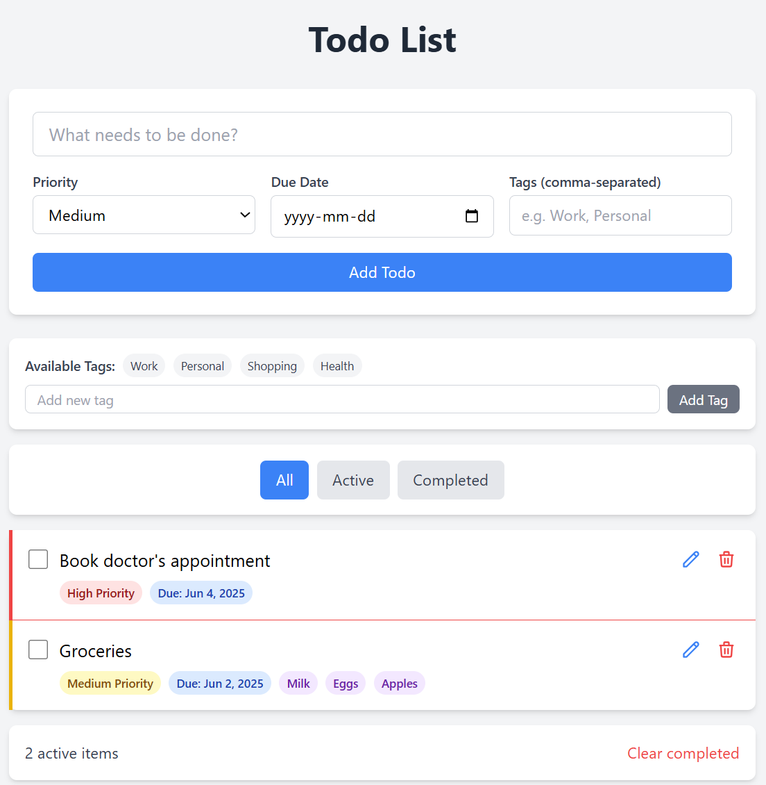

# Todo List App

A feature-rich todo list application built with React, Vite, and Tailwind CSS.

## Features

- ✅ **CRUD Operations**: Add, edit, delete, and toggle todos
- 🎯 **Priority Levels**: Assign high, medium, or low priority to tasks
- 📅 **Due Dates**: Set due dates for todos
- 🏷️ **Tags/Categories**: Organize todos with custom tags
- 🔍 **Filtering**: View all, active, or completed todos
- 🔄 **Drag & Drop**: Reorder todos by dragging
- 💾 **Local Storage**: Todos persist between sessions
- 🎨 **Responsive Design**: Clean UI with Tailwind CSS

## Screenshots

### Main View


### Drag and Drop


## Getting Started

### Prerequisites
- Node.js (v14 or higher)
- npm

### Installation

1. Clone the repository:
```bash
git clone <repository-url>
cd TodoListApp
```

2. Install dependencies:
```bash
npm install
```

Note: If you encounter issues on Windows/WSL, you may need to use `npm install --no-bin-links`

### Running the App

Start the development server:
```bash
npm run dev
```

The app will be available at `http://localhost:5173`

## Usage

1. **Adding Todos**: Type in the input field and click "Add Todo" or press Enter
2. **Setting Priority**: Select priority level before adding
3. **Due Dates**: Choose a due date from the date picker
4. **Tags**: Add comma-separated tags (e.g., "Work, Important")
5. **Editing**: Click the pencil icon to edit a todo's text
6. **Deleting**: Click the trash icon to remove a todo
7. **Completing**: Click the checkbox to mark as complete/incomplete
8. **Reordering**: Drag todos to reorder them
9. **Filtering**: Use the All/Active/Completed buttons to filter view

## Project Structure

```
├── src/
│   ├── components/
│   │   ├── Todo/               # Todo-related components
│   │   └── SortableItem.jsx    # Drag-and-drop wrapper
│   ├── hooks/                  # Custom React hooks
│   ├── utils/                  # Utility functions
│   ├── constants/              # App constants
│   ├── App.jsx                 # Main application component
│   ├── main.jsx                # React entry point
│   └── index.css               # Tailwind CSS imports
├── index.html                  # HTML entry point
├── package.json                # Dependencies and scripts
├── vite.config.js              # Vite configuration
├── tailwind.config.js          # Tailwind configuration
├── postcss.config.js           # PostCSS configuration
└── README.md                   # This file
```

## Technologies Used

- **React 18**: UI framework
- **Vite**: Build tool and dev server
- **Tailwind CSS**: Utility-first CSS framework
- **@dnd-kit**: Drag and drop functionality
- **date-fns**: Date formatting
- **Local Storage API**: Data persistence

## Building for Production

```bash
npm run build
```

The production-ready files will be in the `dist` directory.

## Deployment

This app is configured for deployment on Netlify. Simply connect your GitHub repository to Netlify for automatic deployments.

## Future Enhancements

- Add todo search functionality
- Implement todo deadlines with notifications
- Add dark mode toggle
- Export/import todos
- Add subtasks support